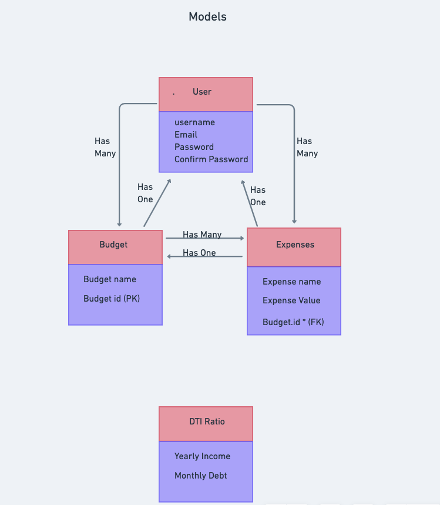

# SAF

# Description

### This app allows users to create budgets for themselves. Users can view other people's budgets, and can use a DTI(debt-to-income) calculator. This is a great way for users to manage their finances, and see what they need to imporve.

# Wireframes

# Dependencies

- React-router-dom
- Django
- Psycopg2-binary
- Postgresql

# Component Hierarchy

# Model Relationships

- One to Many
  
